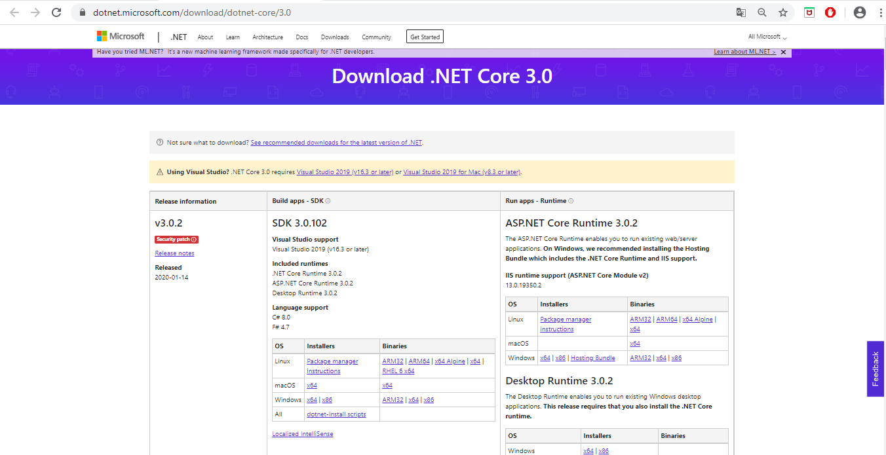
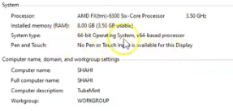

#   Ejercicio de Markdown

##   Instalación de dotnet core 2.2. 
Lo primero que tenemos que hacer es bajar el 
archivo de instalación del siguiente lugar:
[.net descarga](https://dotnet.microsoft.com/download/dotnet-core/3.0)

Es importante bajar el SDK, porque **vamos a programar**.

La pagina se ve asi:

Antes de descargar es necesario revisar los requisitos de el procesador:

Una vez elegido el programa correcto instalar y posteriormente abrir el instalador.
Despues leer los terminos y condiciones e instalar.

##   Instalación y configuración de Visual Studio Code para C#.
Para instalar visual studio code es necesario ir al siguiente lugar:
[Visual studio code descarga](https://code.visualstudio.com/download) 

La pagina se ve de la siguiente manera:

Elegir la version y plataforma que se desea descargar.

Una vez instalado el instalador, leer los terminos y condiciones.
Al aceptarlos elegir las opciones de instalación y terminar de descargar.

##   Instalación de git. conectado a tu cuenta de GitHub.
Al querer descargar Git se necesita visitar la siguiente pagina:
[Git descarga](https://git-scm.com/downloads)

Es recomendable descargar la más reciente.
Será necesario elegir la opción de su sistema operativo (Linux, Mac y Windows).

Instalar y posteriormente abrir y aceptar 
terminos y condiciones para terminar de instalar.

Para conectar con tu cuenta abrir el programa de git e iniciar sesión en tu perfil.